# Ejercicio 1
### Crear Repositorio
1. Crea un repositorio en tu máquina y crea en él un fichero README.md en el que realices la documentación de los siguientes ejercicios. 
	
2. Al finalizar cada ejercicio realiza un push para que se suba a un repositorio público en GitHub o GitLab.

# Ejercicio 2
#### Crear en LDAP una nueva organizationalUnit llamada alumnos. Crea también 6 usuarios pertenecientes a esa unidad. Por último, crea dos grupos (groupOfUniqueNames) llamados daw1 y daw2. De los 6 usuarios creados antes, habrá 3 en cada grupo. Para ello harás un fichero con extensión ldif que deberás añadir al LDAP.

#### Crea a continuación un proyecto dinámico en Eclipse (Dynamic Web Project) llamado repaso. En él haz un fichero index.jsp que muestre la hora actual.
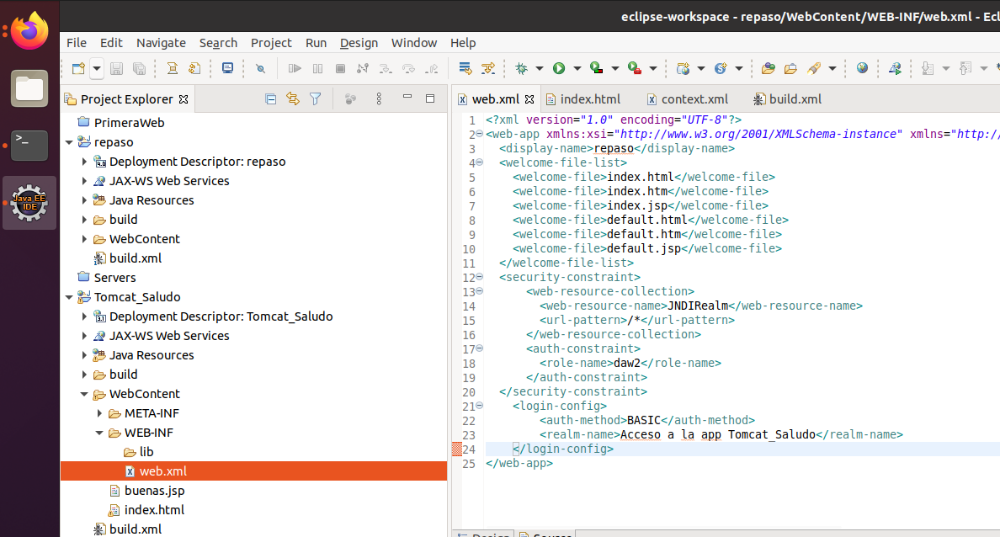
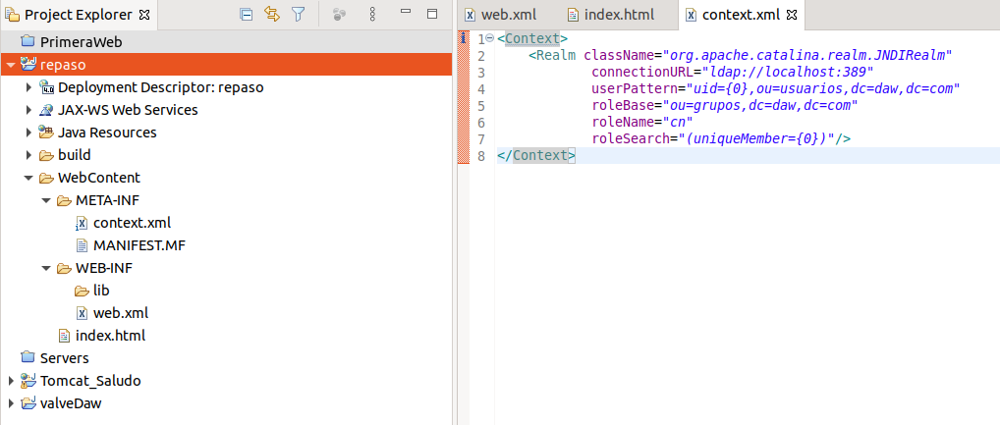
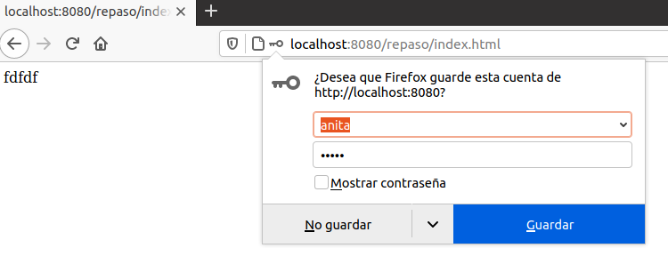
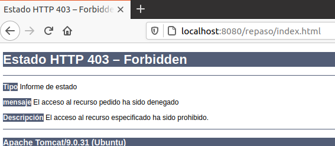

# Ejercicio 3
#### Crea un hos virtual repaso.com

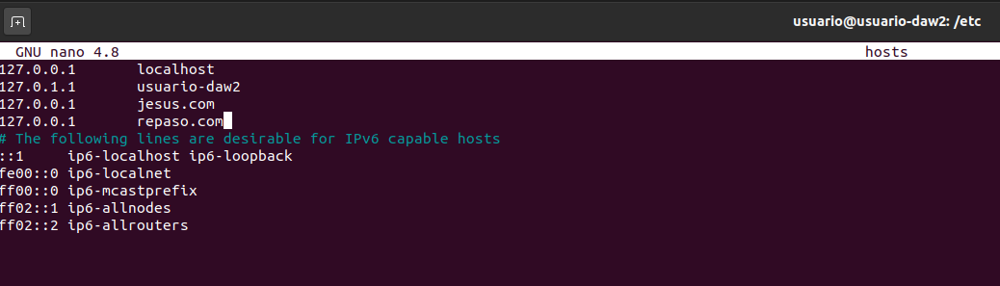
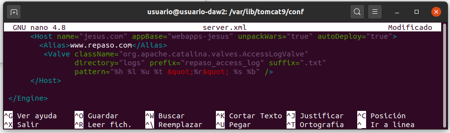
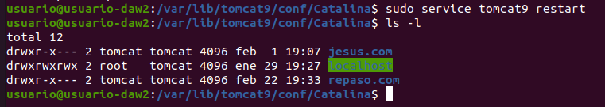
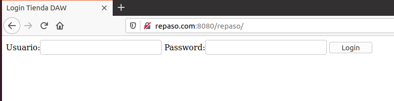
#### Ahora actualizaremos la aplicacion para que se acceda por ssl
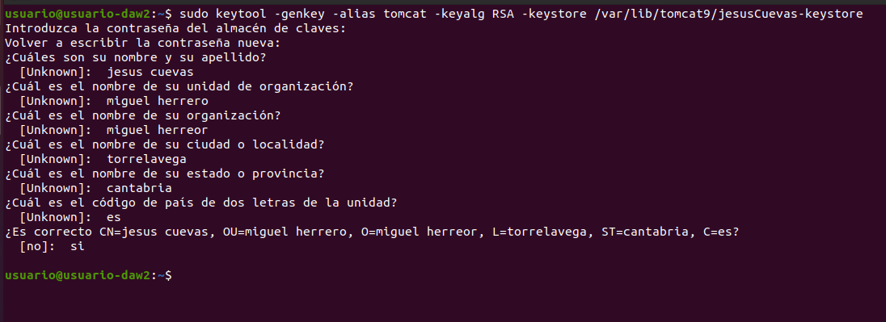
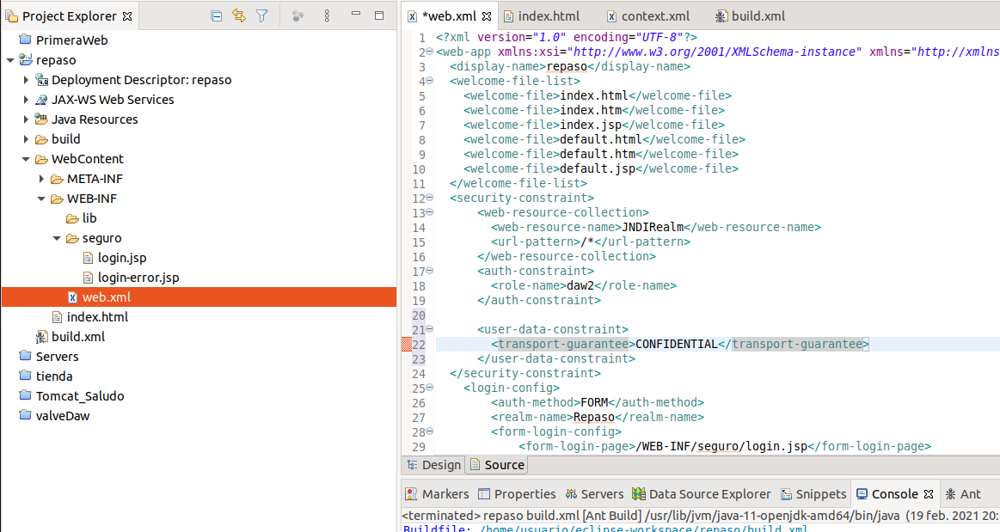
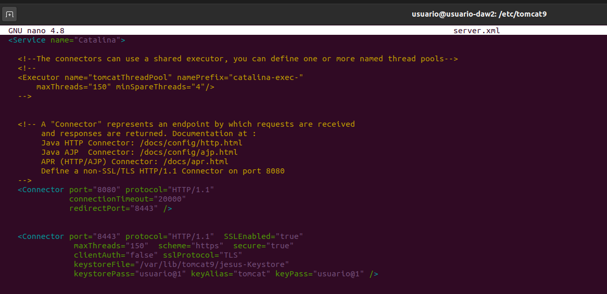
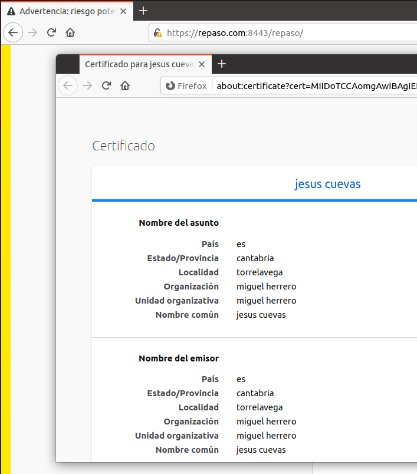
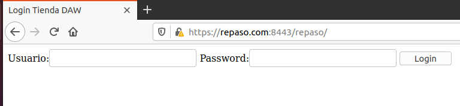
