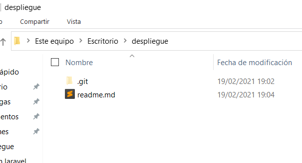
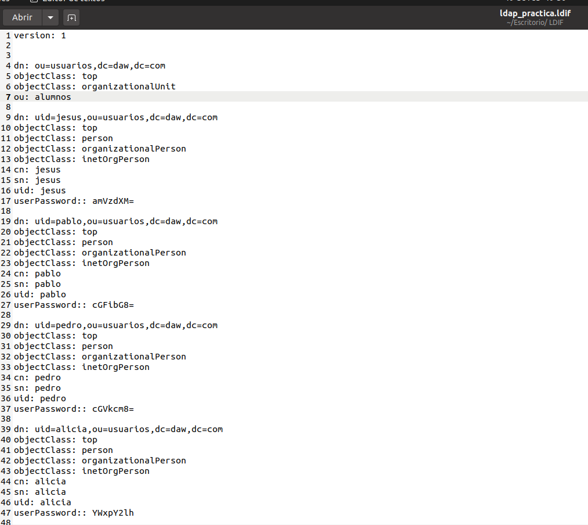
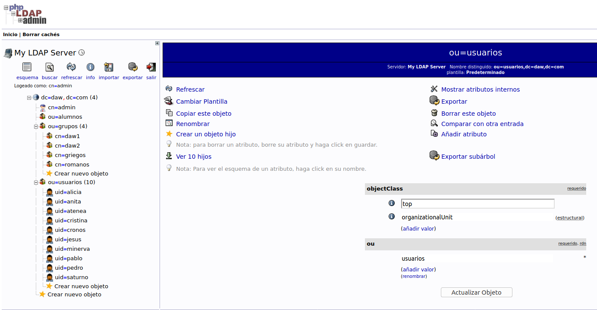

# Ejercicio 1
### Crear Repositorio
1. Crea un repositorio en tu máquina y crea en él un fichero README.md en el que realices la documentación de los siguientes ejercicios. 
	
2. Al finalizar cada ejercicio realiza un push para que se suba a un repositorio público en GitHub o GitLab.

# Ejercicio 2
#### Crear en LDAP una nueva organizationalUnit llamada alumnos. Crea también 6 usuarios pertenecientes a esa unidad. Por último, crea dos grupos (groupOfUniqueNames) llamados daw1 y daw2. De los 6 usuarios creados antes, habrá 3 en cada grupo. Para ello harás un fichero con extensión ldif que deberás añadir al LDAP.

